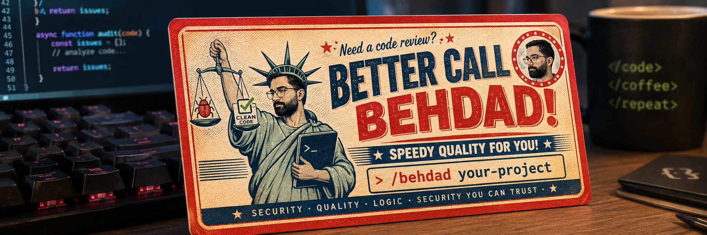
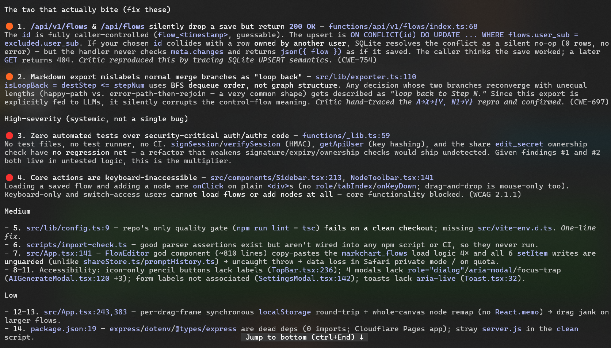
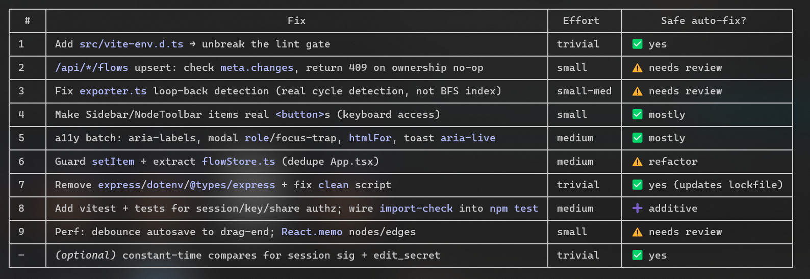

<p align="center">
  
</p>

<h1 align="center">Better-call-behdad</h1>

<p align="center">
  <b>A project-manager-in-a-box for your codebase.</b><br>
  Point it at a project; it tells you — honestly, with evidence — what's wrong and what to do,<br>
  then fixes what you approve.
</p>

<p align="center">
  <a href="LICENSE"></a>
  
  
  
</p>

---

## Why this exists

AI coding assistants made it easy to ship software fast — and easy to ship software that is
quietly **insecure, buggy, untested, or built on the wrong foundations**. The people most likely
to hit these problems are often the least equipped to see them: *you don't know what you don't
know.* There's no "quality-control pass" built into agentic coding tools that stops and asks:

> *Is this project actually good? Is it safe? Is it complete? Does it respect the basics —
> security, correctness, testing, dependencies?*

**Better-call-behdad** (named after Behdad — a great friend and a great project manager) is that
missing pass. It reviews a codebase the way a seasoned tech lead would, across seven dimensions,
grounds every finding in real tooling, explains the risk in plain language, and prioritizes the
fixes — then applies them only after you say yes, with verification and automatic rollback.

## What makes it different: precision over noise

Most AI code reviewers fail the same way — **not by missing bugs, but by crying wolf.** Independent
research (summarized in [`research/`](research/)) found that **92% of AI review tools operate below
a 60% signal ratio**; some flag four noisy comments for every useful one. A tool you can't trust
gets muted, and then it's worthless.

Behdad is built around one axiom: **noise is the enemy.** It deliberately trades a little recall
for a lot of trust, using a layered false-positive defense (details [below](#how-it-stays-quiet-the-false-positive-defense)):

- **Grounds findings in real scanners** (Semgrep, Bandit, Ruff, Gitleaks, OSV-Scanner, …) instead of
  guessing.
- **Suppresses known-noisy categories** up front.
- **Verifies every finding adversarially** — it must *prove itself* (reachable? reproducible?) or
  it's dropped.
- **Abstains when unsure** instead of inventing a problem.
- **Learns from your dismissals** so the same false positive never comes back.

## Proven on a real project

We pointed Behdad at [**MarkChart**](https://github.com/mathofdynamic/markchart) — a real React +
Cloudflare Workers app with auth, a database, and an AI endpoint. In one `/behdad` run it reported
**14 issues** (2 high, 9 medium, 3 low), including two subtle logic bugs no linter catches:

- an API endpoint that returned **`200 OK` but silently saved nothing** on an ownership collision, and
- a Markdown exporter that **mislabeled normal branches as "loop-back"** because it used traversal
  order instead of graph structure.

**The developer then fixed all 14 — in a commit literally titled
[*"Fix Behdad audit findings"*](https://github.com/mathofdynamic/markchart/commit/bebcbed).**
Independent re-review of the patched code confirms every issue resolved, with **0 confirmed false
positives** and a correct **clean-on-security** verdict.

<p align="center">
  
  
</p>

📄 **[Read the full case study →](docs/CASE-STUDY-markchart.md)** — with the evidence, the exact
numbers, and honest limitations (it was the author's own project; more blind trials to come).

## How it works

> 🗺️ **[Explore the flow interactively on MarkChart →](https://markchart.pages.dev/s/5DTWTdHFSHE)**
> &nbsp;(source: [`docs/flow.markchart`](docs/flow.markchart))

```
  /behdad <project>
      │
  0 · understand   map the repo, detect languages & stack, pick the relevant inspectors
      │
  1 · scan         run real static-analysis tools → one normalized, evidence-grounded finding stream
      │
  2 · inspect      7 specialist agents run in parallel — each grounds on the scan + adds its judgment
      │
  3 · verify       a skeptical "critic" agent makes every finding prove itself; kills false positives
      │
  4 · report       a high-reasoning "manager" dedups, ranks by real risk, and writes two reports
      │
  5 · confirm  ⟵── you review. Nothing is changed until you approve. (writes are hard-blocked)
      │
  6 · fix          approved fixes are applied on a snapshot, verified, and rolled back if they break
      │
  7 · learn        dismissed findings are remembered so they don't recur
```

### The team of agents

| Agent | Role | Reasoning |
|-------|------|-----------|
| **Manager** | Orchestrates the run, dedups & ranks findings, writes the reports, drives the fix workflow | High |
| **Critic** | Adversarially verifies each finding — reachability, reproduction, category exclusion | High |
| **7 Inspectors** | One specialist per dimension; ground on scanner output + add human-style judgment | Fast/cheap |

### The seven inspectors

| Inspector | Looks for | Grounded by |
|-----------|-----------|-------------|
| 🔒 **Security** | Injection, secrets, weak crypto, broken access control, insecure design | Semgrep, Bandit, Gitleaks, CodeQL |
| 🧱 **Quality** | SOLID violations, complexity, real maintainability smells (never style nits) | Ruff, ESLint, complexity metrics |
| 🧠 **Logic** | Off-by-one, inverted conditions, mishandled errors, contract violations | Type-checkers (weak tooling → strictest verification) |
| ⚡ **Performance** | N+1 queries, super-linear loops, unbounded resources on hot paths | Heuristics + reasoning |
| 🧪 **Testing** | Untested critical paths, assertion-free tests, missing edge cases | Coverage, test presence |
| 📦 **Supply-chain** | Known-vulnerable dependencies, license compatibility, dependency hygiene | OSV-Scanner, Trivy |
| ♿ **Accessibility** | WCAG 2.2 issues: alt text, labels, keyboard operability, ARIA | Markup analysis |

Inspectors only run when they're relevant (no accessibility pass on a repo with no UI), which keeps
runs fast and cheap.

### What you get: two reports

1. **Full Diagnostic Report** — a plain-language verdict on the project's health, plus every verified
   finding with its evidence, severity, and a *"here's why this matters"* explanation written for
   people who don't know what they don't know.
2. **Prioritized Action Report** — an ordered to-do list, ranked by **blended real-world risk**
   (technical severity × exploit likelihood × reachability, not raw severity), each item marked with
   whether Behdad can fix it automatically.

Every finding is typed and carries canonical IDs (CWE, OWASP, ASVS, WCAG) so it's traceable and
de-duplicated across tools and agents.

## How it stays quiet: the false-positive defense

This is the heart of the product. Each finding runs a gauntlet before it ever reaches you:

1. **Deterministic grounding** — scanner-anchored findings are trusted; pure-LLM findings face the
   hardest scrutiny.
2. **Category exclusion** — known-noisy classes (unproven DoS, generic "add input validation", style
   nitpicks) are stripped up front.
3. **Adaptive voting** — multiple independent inspectors must agree on high-severity or single-source
   findings.
4. **The critic gate** — each survivor must demonstrate reachability / reproduction, or it's rejected.
5. **Explicit abstain** — "I'm not sure" is a valid, encouraged answer; unsure findings are held back.
6. **Confidence calibration** — low-confidence, non-grounded findings are gated out.
7. **Learned suppressions** — anything you dismiss is remembered per-project.

## Safety model

Behdad **never edits your code before you approve it** — and that's enforced at the execution layer,
not just promised by a prompt:

- On Claude Code, a `PreToolUse` hook **hard-blocks** every write/edit/shell mutation until you
  approve the action report. The model literally cannot bypass it.
- Approved fixes are applied on a **snapshot**, verified against your tests/scanners, and
  **automatically rolled back** if anything regresses. A broken fix is reported as rolled-back —
  never as success.
- The code under audit is treated as **untrusted input**; Behdad is hardened against prompt-injection
  attempts hidden in the code it reviews.

## Install

Full instructions for both hosts are in [`INSTALL.md`](INSTALL.md). Short version:

### Claude Code
```bash
git clone https://github.com/mathofdynamic/better-call-behdad.git
cd better-call-behdad
python platform/claude/install.py        # installs the skill, agents, /behdad command, and fix-gate hook
```
Then, in a **new** session:
```
/behdad this                 # audits the current directory
/behdad path/to/your/project # …or any path
```
…or just ask: *"audit this project with behdad."*

### OpenAI Codex
```bash
git clone https://github.com/mathofdynamic/better-call-behdad.git
cp better-call-behdad/platform/codex/agents/behdad-*.toml <your>/.codex/agents/
```
See [`INSTALL.md`](INSTALL.md#openai-codex) for the details.

### Optional but recommended — install the scanners for full recall
```bash
pip install ruff bandit semgrep          # plus gitleaks, osv-scanner, trivy from their installers
```
Behdad works without them; it just reports **reduced recall** honestly rather than pretending.

## Design & architecture

```
better-call-behdad/
├── SKILL.md              # the skill entry point + the manager's operating procedure
├── AGENTS.md             # how to contribute to this repo
├── agents/               # portable agent definitions (source of truth)
│   ├── manager.md · critic.md · _common-finding-protocol.md
│   └── inspectors/       # the 7 specialists
├── scripts/              # the deterministic layer (stdlib-only Python, no install step)
│   ├── run_scanners.py   # detect languages → run scanners → normalized findings
│   ├── sarif_normalize.py# 6 tool formats → one finding shape
│   ├── aggregate.py      # dedup, consensus, blended-risk ranking, confidence gating
│   ├── remediate.py      # staged apply → verify → auto-rollback
│   └── suppressions.py   # learn-from-dismissals store
├── config/               # inspectors ↔ standards ↔ tools, FP-exclusions, risk model
├── schemas/              # the finding & report contracts everything speaks
├── platform/             # thin host bindings — claude/ (hooks, command) and codex/ (TOML)
├── tests/                # seeded repo (planted bugs + noise-traps) + KPI eval harness
└── research/             # the evidence base behind every design decision
```

**Portability** is a first principle: the audit logic lives once in `agents/` + `scripts/`, and each
host gets only a thin binding layer. The same skill runs on Claude Code and Codex, built to the open
**Agent Skills** and **AGENTS.md** standards.

## Is it actually tested?

Yes — the deterministic backbone is covered by an evaluation harness that runs against a **seeded
repo** containing both planted bugs and deliberate *noise-traps* (benign code designed to bait false
positives):

```bash
python tests/eval/run_eval.py      # 18/18 checks green
```
It verifies the scanners find the planted SQLi / command-injection / weak-crypto / hardcoded-secret,
that the noise-traps are **not** flagged, that dedup/ranking/gating behave, and that remediation
rolls back a bad fix. The multi-agent orchestration is validated in live agent sessions.

## Grounded in research, not vibes

Every design choice traces back to two independent research efforts (reconciled in
[`research/`](research/)): a survey of standards & rubrics, existing SAST/SCA tooling, prior-art AI
reviewers and their failure modes, multi-agent orchestration patterns, and false-positive reduction.
Start with [`research/claude-side/00-index.md`](research/claude-side/00-index.md).

## Credits

Named after **Behdad** — a great friend and a great project manager, whose instinct for "what's
actually wrong and what should we do about it" is exactly what this tool tries to bottle.

## License

[MIT](LICENSE).
